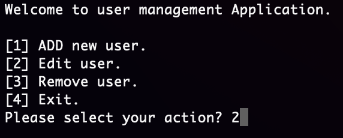

# Challenge #1 – Console Menu Application
## What should it do?
A console application which will show a list of options (as menu items) with a number associated to each option.
It should ask user to enter one of the associated numbers.

You can test application by downloading [jar](./assets/P02.jar) file and running the following command:
```
java -jar P02.jar
```


this application is written with JAVA 13:
```
java version "13.0.1" 2019-10-15
Java(TM) SE Runtime Environment (build 13.0.1+9)
Java HotSpot(TM) 64-Bit Server VM (build 13.0.1+9, mixed mode, sharing)
```

## Acceptance Criteria
- User can select a number that associated to menu items and see a message "You selected menu number #".
- Selected number should be in the menu range.
- If selected number was not in the range, application should show menu again and ask for menu number.
- Allow user to exit if he selects last item of menu.

## Extra Credit!
- Every time application shows menu, it should clean the screen and show the list 
